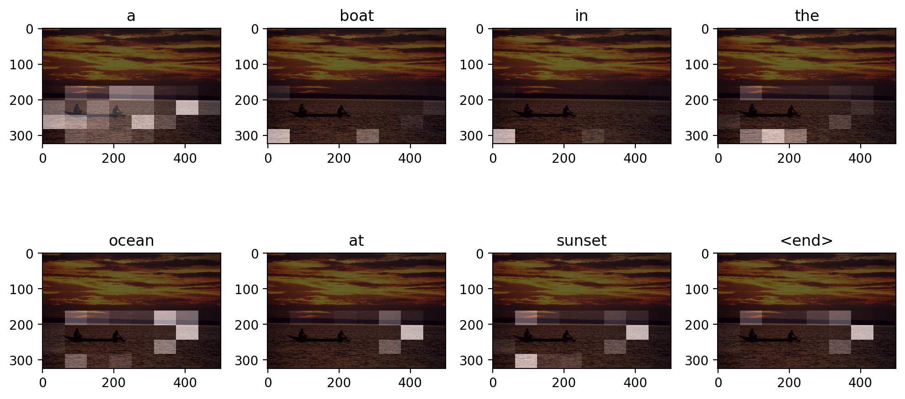
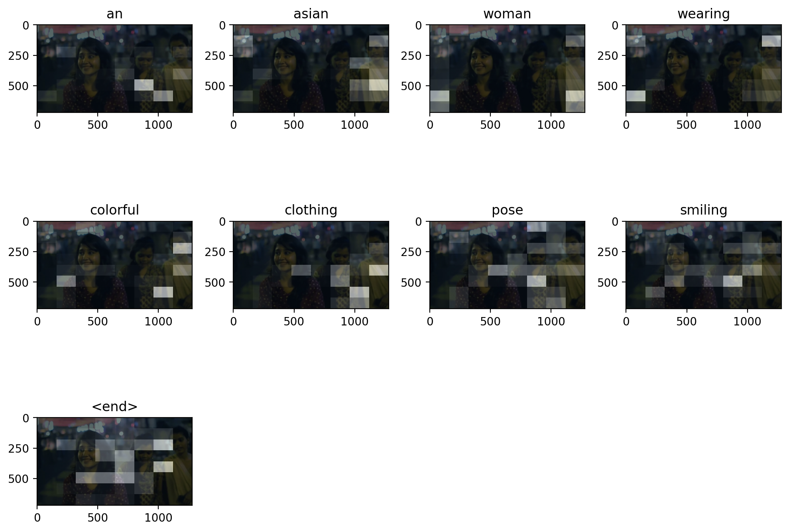
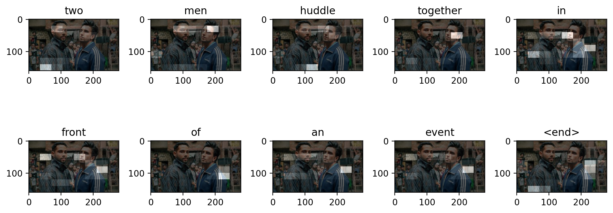
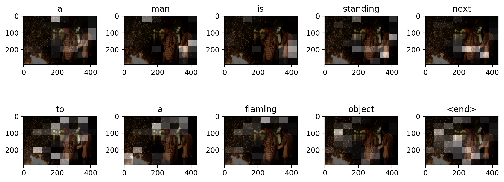
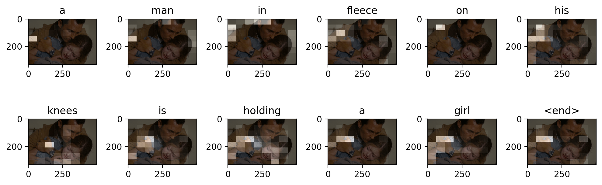

# Image captioning 
Inspired from the paper "Show Attend and Tell". This project's aim was to train a neural network which can provide descriptive text for a given image.

## Overview
Architecture basically consists of encoder-decoder Neural Network, where encoder extracts feature from the image and decoder interprets those features to produce sentence.

Encoder consists of a pre-trained Inception-V3 model (minus the last Fully Connected layers) appended by a custom Fully Connected layer.
Decoder consists of LSTM along with visual-attention. Visual attention helps LSTM in focusing on relevant image features for the prediction of a particular word in word sequence (sentence)

For word embedding, a custom word2vec model was trained and it was then intersected with Google's pre-trained word2vec model.

Feature extarction and pre-processing done in colab and final training is done in kaggle.

Flickr8k Dataset was used for creating train and test sets.

## Technologies used

InceptionV3, LSTM, visual-attention, Word2Vec

## Libraries used

Tensorflow, Keras, Gensim, Numpy, Pandas, Sklearn, Pickle, Pillow, Matplotlib

## Using pretrained models
In order to use these pretrained models, clone/download this repository. Make sure that you have Tensorflow, Numpy, Matplotlib and Pillow installed on your system. Your system should also have Python 3.
 

## Results

Following are some of the results. You can look at some more results in the Evaluate.ipynb 

